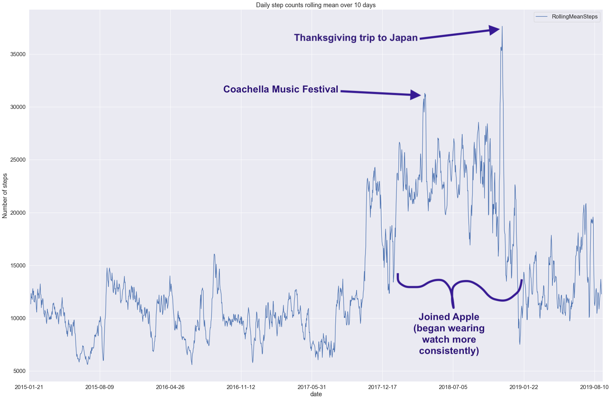

# Apple-Health-Data-Analysis
Analyzing data from Apple Health App in Python

I have been wearing my apple watch consistently everyday for the last two years. I realized that this has resulted in a significant amound of data being stored about my health. Although apple provides basic visualizations of this data in their health app there is no easy way to explore trends and statistics about the data over time. This offered a perfect opporutnity to apply some data visualization techniques to see if there are any interesting insights from all this health data.

